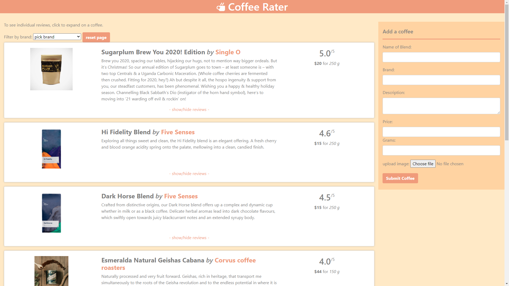

# Project2: Coffee Rater

## About
This web app is created for BCS Project 2. Known as "Coffee Rater", it is a web site that allows users to upload details about a coffee and give it a rating and review. Other users can give their own ratings and reviews to existing coffee entries, or simply view them. Listed coffees can be filtered by brand name.

This project is in Model-View-Controller format and uses Express, Express-Handlebars, Sequelize, and MySQL. It also makes use of the Cloudinary service for image hosting. The live version is hosted on Heroku and uses a JawsDB database.

## Preview and Live Version
The live version can be seen [here](https://salty-forest-45628.herokuapp.com/).

## Features
Posts are sorted by rating by default.   
Images are hosted through cloudinary resulting in faster loading times and the only information needed to be stored in the database is the cloudinary URL.   
The user can filter the results by brand.   
When the user enters a new review the user name they enter is compared to existing user names to avoid creating unneccessary entries in the db.  
